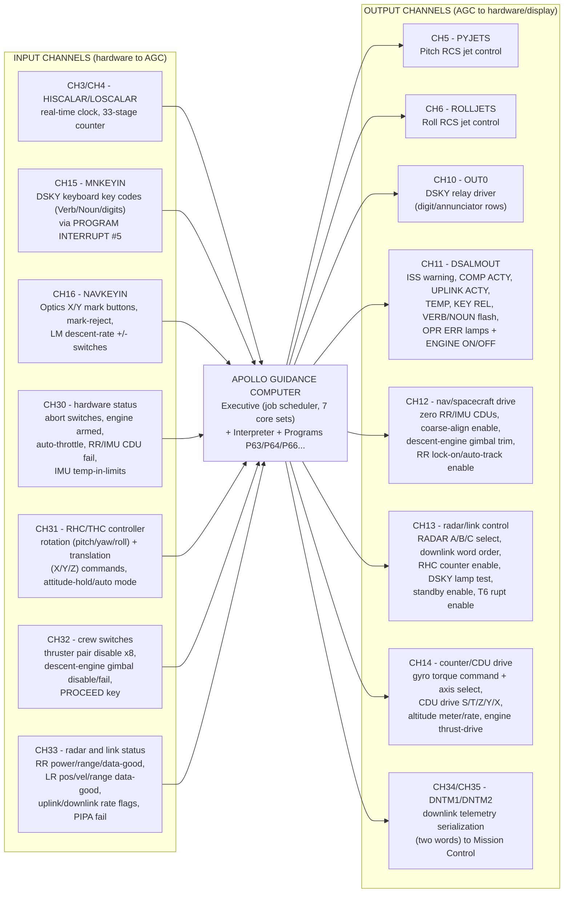

# Apollo Guidance Computer — Input/Output Signal Diagram

This diagram is built directly from the real Luminary099 (Apollo 11 LM) AGC
source file
[`reference/INPUT_OUTPUT_CHANNEL_BIT_DESCRIPTIONS.agc`](../reference/INPUT_OUTPUT_CHANNEL_BIT_DESCRIPTIONS.agc)
(pages 54–60 of the flown listing, transcribed by the Virtual AGC project
from MIT Museum hardcopy). Every channel number, name, and bit meaning
below is taken verbatim (or lightly abbreviated) from that source, not
invented for this demo.

The AGC communicated with the rest of the spacecraft entirely through
**15-bit I/O channels** — there was no generic bus, just a fixed set of
numbered input and output channels wired to specific hardware.

## Diagram

## Full channel reference table

Sourced from `INPUT_OUTPUT_CHANNEL_BIT_DESCRIPTIONS.agc`, pages 54–60.

### Input channels

| Channel | Name | Purpose (as documented in source) |
|---|---|---|
| 1 | — | Identical to computer register **L** |
| 2 | — | Identical to computer register **Q** |
| 3 | HISCALAR | Most significant 14 bits of the 33-stage real-time binary counter (scale B23, ~5.12 s/bit, max ~23.3 h) |
| 4 | LOSCALAR | Next 14 bits of the same counter (scale B9, ~1/3200 s/bit) |
| 15 | MNKEYIN | DSKY keyboard key code, sensed on Program Interrupt #5 (bits 1–5) |
| 16 | NAVKEYIN | Optics X/Y-axis mark signals, mark-reject, LM descent rate +/- switches, sensed on Program Interrupt #6 |
| 30 | — | Abort (descent/ascent stage), engine armed, auto-throttle, RR CDU fail, IMU operate/fail/cage, ISS temp-in-limits |
| 31 | — | RHC rotation commands (±pitch/±yaw/±roll, min-impulse), THC translation (±X/±Y/±Z), attitude-hold / auto-stab mode, RHC out-of-detent |
| 32 | — | Crew thruster-pair disables (8 pairs), descent-engine gimbal disable/fail, **PROCEED key** (bit 14) |
| 33 | CHAN33 | RR auto-power/range-scale/data-good, LR range/pos/vel data-good, uplink/downlink rate flags, PIPA fail, oscillator stopped, repeated-alarm warning |

### Output channels

| Channel | Name | Purpose (as documented in source) |
|---|---|---|
| 5 | PYJETS | Pitch RCS jet control (bits 1–8) |
| 6 | ROLLJETS | Roll RCS jet control (bits 1–8) |
| 7 | SUPERBNK | Fixed-memory bank-extension select bits (not reset by restart) |
| 10 | OUT0 | DSKY latching-relay driver: row number (bits 12–15) + relay settings (bits 1–11) for the digit/annunciator display |
| 11 | DSALMOUT | ISS warning, COMP ACTY lamp, UPLINK ACTY lamp, TEMP caution lamp, KEY REL lamp, VERB/NOUN flash, OPR ERR lamp, caution reset, **ENGINE ON** (bit 13), **ENGINE OFF** (bit 14) |
| 12 | CHAN12 | Zero RR/IMU CDUs, enable CDU/IMU error counters, coarse-align enable, descent-engine gimbal trim (±pitch/±roll), LR position-2 command, RR lock-on/auto-track enable |
| 13 | CHAN13 | RADAR A/B/C parameter select, downlink word-order bit, block uplink, RHC counter enable/start, DSKY lamp test, standby enable, T6 RUPT enable |
| 14 | CHAN14 | Altitude-rate/altitude selector, altitude-meter activity, descent-engine thrust-drive activity, gyro enable/select/torque/activity, **CDU drive S/T/Z/Y/X** |
| 34 | DNTM1 | Downlink telemetry — first of two words serialized to ground |
| 35 | DNTM2 | Downlink telemetry — second of two words serialized to ground |

## Why this matters for the 1202/1201 incident

The incident modeled in this demo (`../fabric/incident_investigation_transcript.md`)
is a direct consequence of this I/O model: **CH13 bit 4 (RADAR ACTIVITY)**
and the RR-related bits of **CH12/CH33** stayed active because the crew
left the rendezvous radar switch in AUTO/SLEW. The resulting stream of
radar-driven counter/interrupt activity (feeding the executive's job queue,
tracked internally rather than through a single named channel) consumed
the AGC's fixed pool of **executive core sets**, which is what
`ALARM_AND_ABORT.agc`'s `BAILOUT`/`POODOO` routines detected and recovered
from by raising alarms 1202/1201 and shedding low-priority jobs — while the
essential channel-5/6 (RCS jets), channel-11 (engine on/off), and
channel-12/14 (gimbal trim, CDU drive) outputs kept the actual landing
guidance running uninterrupted.
